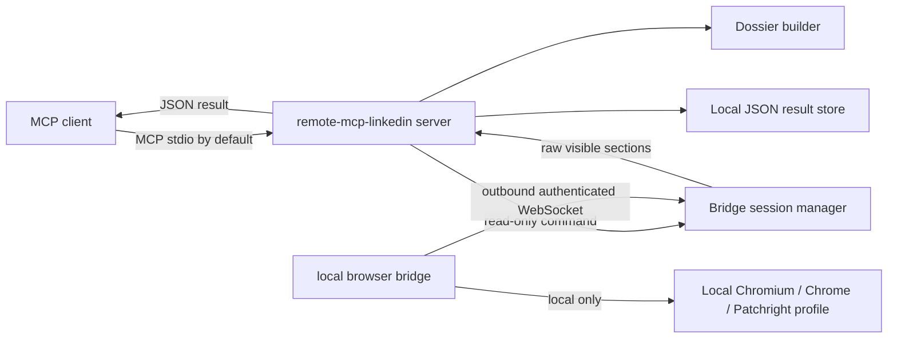

# remote-mcp-linkedin

<p align="left">
  <a href="./LICENSE"></a>
  <a href="./pyproject.toml"></a>
  <a href="./docs/BRIDGE_PROTOCOL.md"></a>
  <a href="./docs/SECURITY.md"></a>
  <a href="https://gofastmcp.com"></a>
</p>

> **Disclaimer:** This is an independent, community project. It is not
> affiliated with, authorized by, endorsed by, or sponsored by LinkedIn
> Corporation or Microsoft. "LinkedIn" is a registered trademark of LinkedIn
> Corporation and is used here only descriptively to identify the third-party
> service this software interoperates with.

`remote-mcp-linkedin` is a Remote LinkedIn MCP server with a local browser
bridge. The server exposes read-only MCP tools and builds structured dossiers;
the bridge runs on the user's machine, uses the user's local browser session,
and returns only visible extracted profile data.

Cookies, browser profiles, storage state, auth headers, session state, browser
fingerprints, and CDP access never leave the local bridge machine.

---

## v0.1 Capabilities

| Component | Description | Status |
| --- | --- | --- |
| `linkedin_profile_get` | MCP tool that requests visible LinkedIn profile sections through the bridge and returns normalized raw data. | working |
| `linkedin_profile_dossier` | MCP tool that builds a deterministic structured dossier from raw profile sections. | working |
| WebSocket bridge protocol | Authenticated outbound bridge connection with `protocol_version: "0.1"`. | working |
| Local result storage | Server-side JSON storage for extracted profile/dossier results only. | working |
| Stub extractor | Deterministic mock extractor for development, CI, and protocol smoke tests. | default |
| Patchright extractor | Experimental local visible-text extractor for Chromium/Patchright. | partial |
| Write actions | Send message, connect, apply job, follow, like, comment. | out of scope |
| Remote browser control | Remote CDP exposure, cookie export, browser profile export, arbitrary shell commands. | not implemented |

v0.1 is single-user and single-bridge. The architecture leaves room for
multi-user routing later, but it is not implemented in this release.

## Architecture



The server is the MCP and orchestration layer. It does not launch a browser.
The bridge is intentionally thin: it receives allowlisted read-only commands,
extracts visible browser data locally, and returns raw sections.

## Quickstart

**Prerequisites:** Python 3.12+, Git, and a local shell.

### 1. Install From Source

```bash
git clone https://github.com/alexanderskorokhodov/remote-mcp-linkedin.git
cd remote-mcp-linkedin

python3.12 -m venv .venv
source .venv/bin/activate
python -m pip install -e ".[dev]"
```

If your machine has a newer Python available, `python3.13` or `python3.14` is
also fine.

### 2. Start The Server

Set a long random token. The same value must be used by the server and bridge.

```bash
export REMOTE_MCP_LINKEDIN_BRIDGE_TOKEN="replace-with-a-long-random-token"
remote-mcp-linkedin-server
```

The server uses MCP stdio by default. It also starts a local WebSocket listener
for the bridge on `127.0.0.1:8765`.

### 3. Start The Local Bridge

In another terminal:

```bash
cd remote-mcp-linkedin
source .venv/bin/activate

export REMOTE_MCP_LINKEDIN_BRIDGE_TOKEN="replace-with-a-long-random-token"
remote-mcp-linkedin-bridge
```

By default, the bridge uses the `stub` extractor. This is expected in v0.1 and
is useful for validating the full MCP/server/bridge flow without opening a real
LinkedIn session.

### 4. Optional HTTP MCP Mode

HTTP is disabled by default because v0.1 does not ship MCP HTTP authentication.
Only enable it on loopback or behind your own trusted access control.

```bash
remote-mcp-linkedin-server \
  --transport streamable-http \
  --enable-http \
  --mcp-host 127.0.0.1 \
  --mcp-port 8000 \
  --mcp-path /mcp
```

## MCP Client Configuration

For a local MCP client that launches the installed console script:

```json
{
  "mcpServers": {
    "remote-mcp-linkedin": {
      "command": "remote-mcp-linkedin-server",
      "env": {
        "REMOTE_MCP_LINKEDIN_BRIDGE_TOKEN": "replace-with-a-long-random-token"
      }
    }
  }
}
```

Run `remote-mcp-linkedin-bridge` separately on the machine that owns the browser
session.

## MCP Tools

| Tool | Input | Output |
| --- | --- | --- |
| `linkedin_profile_get` | `profile_url` or `username`, optional `sections` | Raw normalized visible profile extraction result |
| `linkedin_profile_dossier` | `profile_url` or `username`, optional `include_posts` | Structured dossier with evidence, gaps, warnings, confidence, and `extracted_at` |

Available sections:

```text
top_card, about, experience, education, skills, certifications,
projects, languages, contact_info, posts
```

## Experimental Browser Extraction

The default extractor is `stub`, which returns deterministic mock data. This is
not hidden: responses include a `STUB_BROWSER_EXTRACTION` warning.

To try the experimental Patchright extractor:

```bash
python -m pip install -e ".[browser]"

export REMOTE_MCP_LINKEDIN_EXTRACTOR=patchright
export REMOTE_MCP_LINKEDIN_HEADLESS=false
remote-mcp-linkedin-bridge
```

Patchright uses a local persistent browser profile under:

```text
~/.remote-mcp-linkedin/bridge-profile
```

Override it with `REMOTE_MCP_LINKEDIN_BROWSER_USER_DATA_DIR` if needed. That
path and its contents are local-only and must not be sent to the server.

> [!NOTE]
> The Patchright extractor in v0.1 is partial. It extracts visible page text and
> performs simple section splitting. It is ready for integration work, not full
> production scraping.

## Configuration

<details>
<summary><b>Server environment</b></summary>

| Variable | Default | Description |
| --- | --- | --- |
| `REMOTE_MCP_LINKEDIN_BRIDGE_TOKEN` | required | Shared token used to authenticate the local bridge. |
| `REMOTE_MCP_LINKEDIN_BRIDGE_HOST` | `127.0.0.1` | WebSocket listener host for bridge connections. |
| `REMOTE_MCP_LINKEDIN_BRIDGE_PORT` | `8765` | WebSocket listener port for bridge connections. |
| `REMOTE_MCP_LINKEDIN_RESULTS_DIR` | `.remote-mcp-linkedin/results` | Local directory for extracted profile/dossier JSON results. |
| `REMOTE_MCP_LINKEDIN_LOG_LEVEL` | `INFO` | Server log level. |

</details>

<details>
<summary><b>Bridge environment</b></summary>

| Variable | Default | Description |
| --- | --- | --- |
| `REMOTE_MCP_LINKEDIN_SERVER_URL` | `ws://127.0.0.1:8765/bridge` | Server WebSocket URL. |
| `REMOTE_MCP_LINKEDIN_BRIDGE_TOKEN` | required | Shared token used to authenticate to the server. |
| `REMOTE_MCP_LINKEDIN_HEADLESS` | `false` | Browser headless mode for Patchright. |
| `REMOTE_MCP_LINKEDIN_EXTRACTOR` | `stub` | `stub` or `patchright`. |
| `REMOTE_MCP_LINKEDIN_BROWSER_USER_DATA_DIR` | `~/.remote-mcp-linkedin/bridge-profile` | Local browser profile path for Patchright. |
| `REMOTE_MCP_LINKEDIN_BROWSER_TIMEOUT_MS` | `15000` | Browser navigation/extraction timeout. |

</details>

## Security Model

- The bridge authenticates to the server with a shared token.
- The bridge makes an outbound WebSocket connection; the server does not reach
  into the user's browser.
- The server rejects unauthenticated bridge connections.
- The MCP server uses stdio by default and refuses HTTP unless `--enable-http`
  is explicitly provided.
- The bridge accepts only allowlisted read-only commands in v0.1.
- Cookies, browser profiles, storage state, auth headers, full session state,
  fingerprint material, and CDP access are never sent to the server.
- Logs must not include bridge tokens, cookies, auth headers, browser profile
  paths, or browser session state.

Read more in [docs/SECURITY.md](docs/SECURITY.md).

## Limitations

- LinkedIn page structure changes frequently; DOM/text extraction is fragile.
- Use may be subject to LinkedIn terms and account restrictions.
- Extracted data is limited to what the local logged-in user can see.
- Captchas, login challenges, rate limits, and account checkpoints can block
  extraction.
- v0.1 is single-user/single-bridge.
- The real browser extractor is intentionally minimal and incomplete.

## Development

```bash
python -m pip install -e ".[dev]"
pytest
ruff check .
```

<details>
<summary><b>Local smoke flow</b></summary>

Terminal 1:

```bash
export REMOTE_MCP_LINKEDIN_BRIDGE_TOKEN="dev-token"
remote-mcp-linkedin-server --transport streamable-http --enable-http
```

Terminal 2:

```bash
export REMOTE_MCP_LINKEDIN_BRIDGE_TOKEN="dev-token"
remote-mcp-linkedin-bridge --extractor stub
```

Connect an MCP inspector or FastMCP client to:

```text
http://127.0.0.1:8000/mcp
```

</details>

## Documentation

- [Architecture](docs/ARCHITECTURE.md)
- [Security](docs/SECURITY.md)
- [Bridge protocol](docs/BRIDGE_PROTOCOL.md)
- [Dossier schema](docs/DOSSIER_SCHEMA.md)
- [Development](docs/DEVELOPMENT.md)

## Attribution

This project was designed with reference to
[`stickerdaniel/linkedin-mcp-server`](https://github.com/stickerdaniel/linkedin-mcp-server),
which is licensed under Apache-2.0. `remote-mcp-linkedin` uses a separate remote
server/local bridge architecture and intentionally omits write-action tools in
v0.1.

