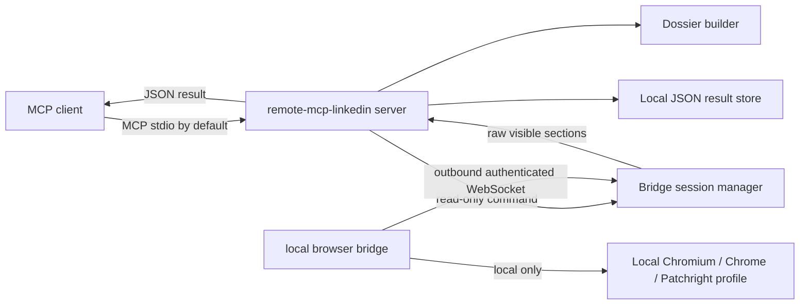

# remote-mcp-linkedin

`remote-mcp-linkedin` is a public open-source prototype for a Remote LinkedIn MCP
server with a local browser bridge.

The server is the MCP and orchestration layer. It exposes read-only MCP tools,
routes extraction commands to a local bridge, stores extracted JSON results, and
builds deterministic profile dossiers. The bridge runs on the user's machine,
opens or reuses a local browser context, and sends back visible profile data.

This project is independent and is not affiliated with, authorized by, endorsed
by, or sponsored by LinkedIn Corporation or Microsoft. "LinkedIn" is used only
to identify the third-party service this software interoperates with.

## Status

v0.1 is intentionally small:

- Working package scaffold and CLIs.
- Working authenticated WebSocket bridge protocol.
- Working MCP tool registration for `linkedin_profile_get` and
  `linkedin_profile_dossier`.
- Working dossier builder and tests.
- Default bridge extractor is a stub for development and protocol smoke tests.
- Optional `patchright` extractor is experimental and only performs minimal
  visible-text extraction. It is not a complete LinkedIn parser yet.

Write actions are out of scope for v0.1. There is no send message, connect,
apply job, follow, like, comment, remote CDP exposure, arbitrary shell command
execution, or cookie/profile export.

## Architecture



Cookies, browser profiles, storage state, auth headers, session state, and
fingerprint data must remain on the bridge machine.

## Quickstart

Create and activate a virtual environment:

```bash
cd remote-mcp-linkedin
python3 -m venv .venv
source .venv/bin/activate
python -m pip install -e ".[dev]"
```

Set a bridge token in both processes:

```bash
export REMOTE_MCP_LINKEDIN_BRIDGE_TOKEN="replace-with-a-long-random-token"
```

Start the MCP server. The safe default transport is stdio:

```bash
remote-mcp-linkedin-server
```

For local smoke testing, run the bridge in another terminal with the default
stub extractor:

```bash
export REMOTE_MCP_LINKEDIN_BRIDGE_TOKEN="replace-with-a-long-random-token"
remote-mcp-linkedin-bridge
```

To expose MCP over HTTP, you must explicitly opt in:

```bash
remote-mcp-linkedin-server --transport streamable-http --enable-http --mcp-host 127.0.0.1 --mcp-port 8000
```

Do not bind HTTP to an untrusted network without adding your own access control.

## Experimental Browser Extraction

The default extractor is `stub`, which returns deterministic mock data. This is
intentional for v0.1 so the protocol, MCP tools, and dossier builder can be
tested without touching a real LinkedIn account.

To try the experimental Patchright path:

```bash
python -m pip install -e ".[browser]"
export REMOTE_MCP_LINKEDIN_EXTRACTOR=patchright
export REMOTE_MCP_LINKEDIN_HEADLESS=false
remote-mcp-linkedin-bridge
```

The Patchright extractor uses a local persistent browser profile under
`~/.remote-mcp-linkedin/bridge-profile` unless
`REMOTE_MCP_LINKEDIN_BROWSER_USER_DATA_DIR` is set. The path is local only and
must not be sent to the server. The current implementation extracts visible page
text and performs simple section splitting; it is expected to be incomplete.

## MCP Tools

`linkedin_profile_get`

- Input: `profile_url` or `username`, optional `sections`.
- Output: normalized raw visible profile sections.

`linkedin_profile_dossier`

- Input: `profile_url` or `username`, optional `include_posts`.
- Output: deterministic structured dossier with `person`, `headline`,
  `location`, `about`, `experience`, `education`, `skills`, `certifications`,
  `projects`, `languages`, `contact_info`, optional `posts`, `evidence`,
  `gaps`, `warnings`, `confidence`, and `extracted_at`.

## Configuration

Server environment:

- `REMOTE_MCP_LINKEDIN_BRIDGE_TOKEN`: required shared bridge token.
- `REMOTE_MCP_LINKEDIN_BRIDGE_HOST`: bridge listener host, default `127.0.0.1`.
- `REMOTE_MCP_LINKEDIN_BRIDGE_PORT`: bridge listener port, default `8765`.
- `REMOTE_MCP_LINKEDIN_RESULTS_DIR`: local extracted JSON result directory.

Bridge environment:

- `REMOTE_MCP_LINKEDIN_SERVER_URL`: default `ws://127.0.0.1:8765/bridge`.
- `REMOTE_MCP_LINKEDIN_BRIDGE_TOKEN`: required shared bridge token.
- `REMOTE_MCP_LINKEDIN_HEADLESS`: `false` or `true`.
- `REMOTE_MCP_LINKEDIN_EXTRACTOR`: `stub` or `patchright`.

## Security Model

- Bridge authentication uses a shared token.
- The bridge makes an outbound WebSocket connection to the server.
- The server rejects unauthenticated bridge connections.
- The MCP server uses stdio by default and refuses unauthenticated HTTP unless
  `--enable-http` is explicitly supplied.
- Only read-only bridge commands are allowlisted in v0.1.
- The bridge never exports cookies, browser profile files, storage state,
  browser fingerprint, auth headers, or CDP access to the server.
- Logs must not include tokens, cookies, auth headers, browser profile paths, or
  full browser session state.

## Limitations and Risks

- LinkedIn page structure changes frequently; DOM/text extraction is fragile.
- Use may be subject to LinkedIn terms and account restrictions.
- Extracted data is limited to what the local logged-in user can see.
- Captchas, login challenges, rate limits, and account checkpoints can block
  extraction.
- The v0.1 Patchright extractor is partial. A production-quality extractor needs
  more robust section detection, fixtures, and regression tests.

## Development

```bash
python -m pip install -e ".[dev]"
pytest
ruff check .
```

The project was designed with reference to
[`stickerdaniel/linkedin-mcp-server`](https://github.com/stickerdaniel/linkedin-mcp-server),
which is Apache-2.0 licensed. v0.1 uses a separate remote server / local bridge
architecture and intentionally omits write-action tools.

