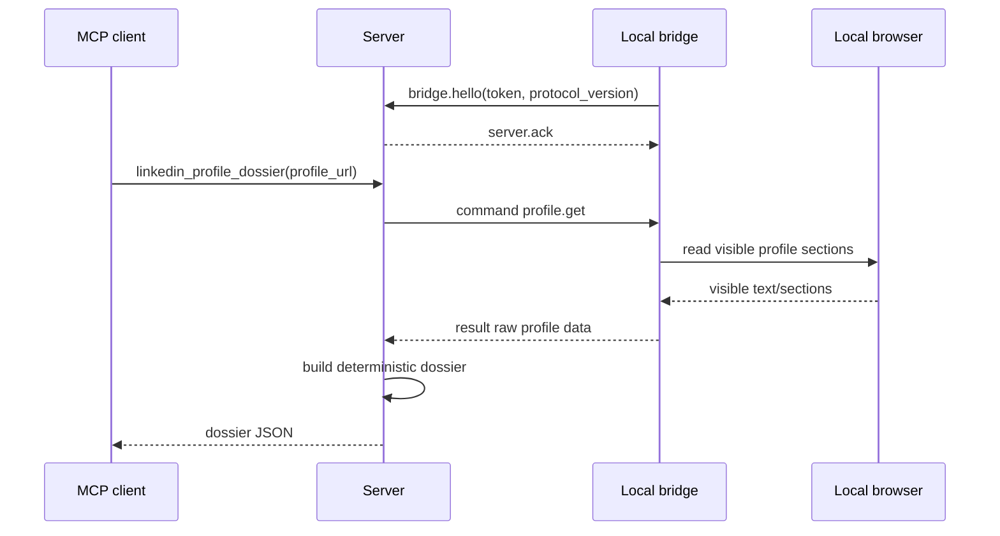

# Architecture

`remote-mcp-linkedin` separates MCP orchestration from browser execution.

## Components

### Server

The server runs FastMCP and exposes read-only LinkedIn tools. It does not launch
a browser and does not import browser automation code. It owns:

- MCP tool registration.
- Bridge connection/session management.
- Command routing to the authenticated local bridge.
- Dossier construction.
- Local storage of extracted JSON results.

### Bridge

The bridge runs on the user's machine and initiates an outbound WebSocket
connection to the server. It owns:

- Local browser session access.
- Read-only extraction commands.
- Browser dependency isolation.
- Returning raw normalized visible profile sections.

The bridge performs no LLM reasoning and does not build dossiers.

### Protocol

The protocol package contains shared Pydantic schemas for:

- Commands.
- Results.
- Errors.
- Raw profile extraction data.

All protocol messages include `protocol_version: "0.1"`.

## Sequence

## v0.1 Scope

v0.1 is single-user and single-bridge. The server accepts one active bridge
session at a time. A later multi-user version should add:

- Bridge identity and tenant isolation.
- Per-bridge command queues.
- Per-user MCP authorization.
- Result storage partitioning.
- Token rotation and revocation.

## Out of Scope

The first version explicitly excludes:

- Sending messages.
- Connecting with users.
- Applying to jobs.
- Following, liking, or commenting.
- Remote CDP exposure.
- Arbitrary shell commands.
- Server-side browser profile or cookie import.

